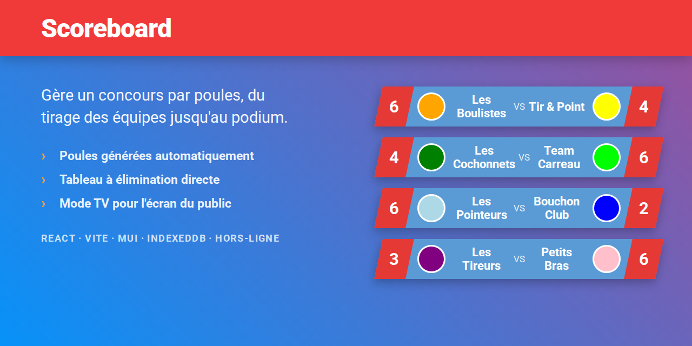
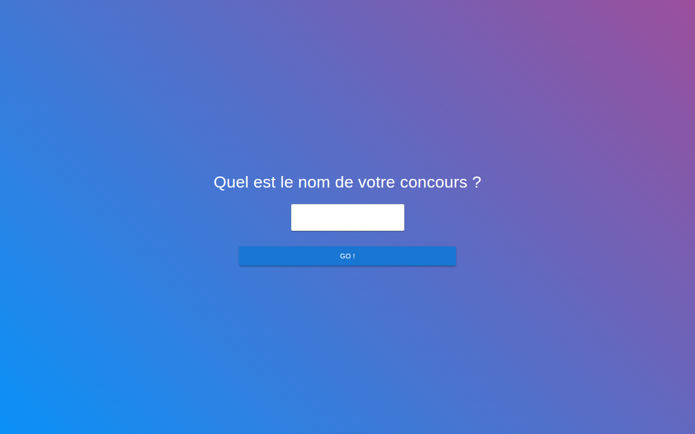
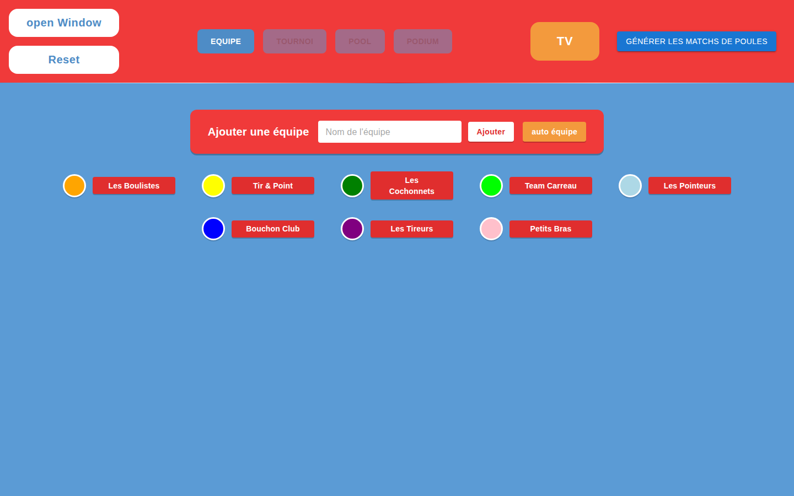
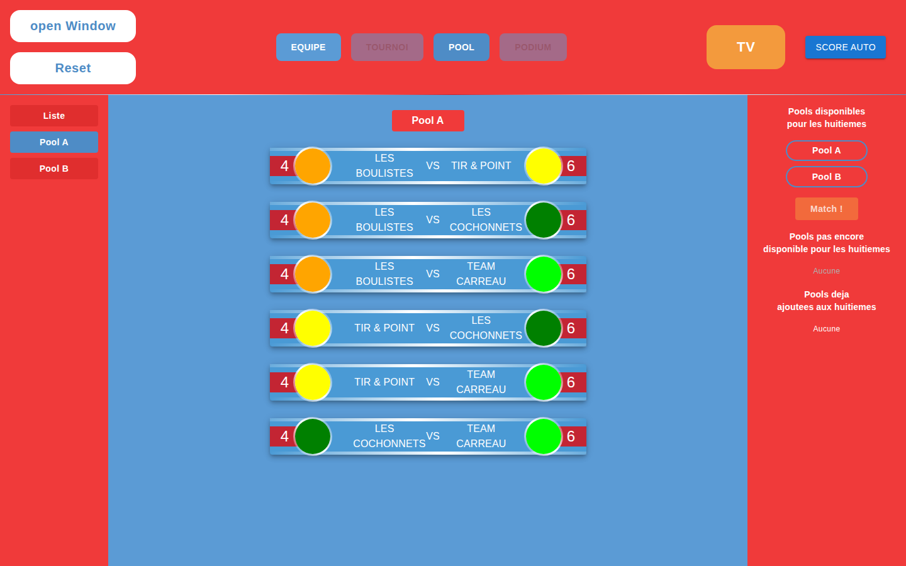
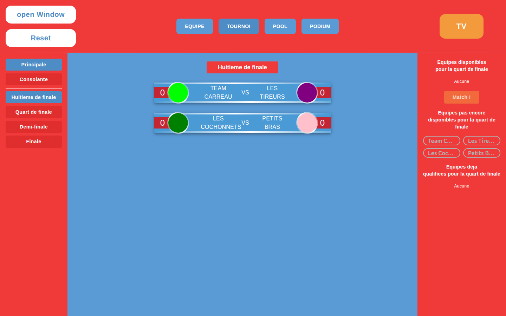
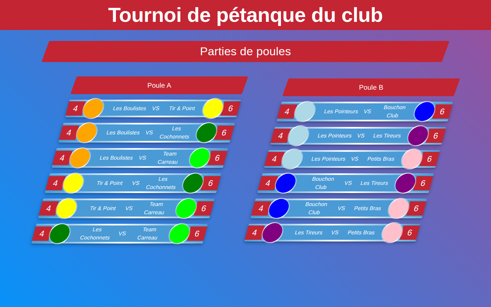

# Scoreboard



Application de gestion de concours par poules — pensée pour la pétanque, utilisable pour
tout tournoi en doublettes. On saisit les équipes, l'application génère les poules et leurs
matchs, on entre les scores, puis les qualifiés basculent dans un tableau à élimination
directe jusqu'au podium.

Un **mode TV** affiche l'état du concours sur un second écran pour les participants.

Tout tourne dans le navigateur : **aucun serveur, aucun compte, aucune connexion**. Le
concours est stocké en IndexedDB sur le poste de l'organisateur.

---

## Aperçu

### 1. Créer le concours



### 2. Saisir les équipes

Les équipes s'ajoutent une par une, chacune recevant une couleur qui la suivra sur tous les
écrans. Le bouton **auto équipe** remplit la liste pour aller vite.



### 3. Générer les poules et saisir les scores

**Générer les matchs de poules** répartit les équipes et crée tous les matchs de chaque
poule (toutes les équipes se rencontrent). Un clic sur un match ouvre la saisie du score.



### 4. Passer au tableau

Une fois une poule terminée, elle devient disponible pour les huitièmes. **Match !** monte
les équipes qualifiées dans le tableau, qui se déroule ensuite jusqu'à la finale — avec une
Principale et une Consolante.



### 5. Le mode TV

**Open Window** ouvre l'écran destiné au public. Le bouton **TV** de la fenêtre de gestion
choisit ce qu'il affiche : les équipes, les poules, le tournoi, le classement ou le podium.



---

## Comment les deux fenêtres se parlent

Pas de backend ni de websocket. La fenêtre de gestion écrit dans `localStorage`, la fenêtre
publique écoute l'évènement `storage` :

```
ManagementContestPage ──(localStorage "contest" / "viewerPage")──▶ ScoreViewerPage
         │
         ├── contestObserver (RxJS BehaviorSubject) ──▶ composants de la même fenêtre
         └── Dexie ──▶ IndexedDB « scoreboard »
```

Les deux écrans doivent donc être **deux fenêtres du même navigateur, sur la même machine**.

Toute mutation du concours doit repasser par `contestSync`
(`broadcastContestUpdate` / `refreshContestState`) : c'est ce qui met à jour à la fois le
miroir `localStorage`, l'observable et donc les deux fenêtres.

---

## Stack

| | |
|---|---|
| Base | React 19 + TypeScript, build [Vite 6](https://vite.dev) |
| UI | MUI 7, Emotion, styled-components |
| Données | [Dexie](https://dexie.org) sur IndexedDB (base `scoreboard`) |
| État partagé | `dexie-react-hooks` (`useLiveQuery`) + un `BehaviorSubject` RxJS |
| Routage | React Router 7 |
| Qualité | ESLint (flat config), Prettier, Vitest (52 tests) |

Ni Redux ni Zustand : la réactivité passe par `useLiveQuery` pour ce qui observe la base, et
par `contestObserver` pour le reste.

---

## Démarrer

```bash
npm install
npm run dev
```

### Scripts

| Commande | Effet |
|---|---|
| `npm run dev` | serveur de développement |
| `npm run build` | vérification TypeScript puis build de production dans `dist/` |
| `npm run preview` | sert le build de production en local |
| `npm run lint` / `lint:fix` | ESLint |
| `npm run format` / `format:write` | Prettier |
| `npm test` / `test:watch` | Vitest |

Lancer un seul fichier de test : `npx vitest run chemin/vers/le.test.tsx`.
Filtrer par nom : `npx vitest run -t "motif"`.

---

## Architecture

Découpage par feature, avec une pile DDD allégée à l'intérieur de chacune.

```
src/
├─ app/                       shell, routeur, configuration
├─ features/
│  ├─ contest-management/     gestion complète du concours
│  │  ├─ domain/model/        types de vue propres à la feature
│  │  ├─ application/         services (contestSync) et utilitaires (générateurs)
│  │  ├─ infra/db/            requêtes Dexie + hydratation des clés étrangères
│  │  └─ ui/                  pages, composants, formulaires
│  └─ contest-viewer/         mode TV, en lecture seule
└─ shared/                    base Dexie, modèles, tokens de design, UI commune
```

Alias d'import : `@app/*`, `@features/*`, `@shared/*`.

Quelques conventions qui comptent :

- Les entités se référencent par identifiant (`pool.matchs` est un tableau d'ids). Une
  lecture doit donc **hydrater** les lignes liées — voir `infra/db/hydrateMatch.ts` et
  `hydrateTeam.ts`.
- La logique de transformation état → props vit dans les fichiers `*.vm.ts` à côté de la
  page ; les composants de page restent minces.
- Les accès à la base passent par `infra/db`, jamais par un import direct de `db` depuis un
  composant.
- ESLint impose l'ordre des imports (groupes alphabétisés, ligne vide entre groupes).

---

## Tests

```bash
npm test
```

52 tests couvrent ce qui s'exerce sans IndexedDB : les helpers partagés, le hook de
timeouts, les invariants des tables de couleurs et de noms de poules, les deux view-models,
et l'hydratation des équipes et des matchs contre une base simulée.

`src/test/setup.ts` installe un `Storage` en mémoire : jsdom 27 n'en fournit pas
d'utilisable, alors que `contestSync` et l'en-tête en dépendent. **Ne pas le retirer.**

---

## Déploiement

`npm run build` produit un site statique dans `dist/`, déployable tel quel.

- L'application a deux routes (`/` et `/contest-viewer`) gérées côté client : le serveur
  doit renvoyer `index.html` sur les URL inconnues. Le `.htaccess` fourni à la racine du
  dépôt fait ça pour Apache — **il n'est pas copié dans `dist/`** par le build, il doit donc
  déjà être présent sur l'hébergement.
- Les fichiers du build sont nommés par hash : envoyer le contenu de `dist/` suffit.

---

## Limites connues

- **La taille des équipes et des poules est figée dans le code** : 2 joueurs par équipe et
  4 équipes par poule, écrits en dur dans `AddContest.tsx`. Rien ne les rend configurables
  à la création du concours.
- **Le nombre d'équipes doit être pair**, sinon la génération des poules refuse de partir.
- Les générateurs de poules et de matchs (`PoolGenerator`, `MatchOutPoolGenerator`) sont des
  composants React qui écrivent directement en base : leur logique n'est pas isolée, donc
  pas couverte par les tests.
- Le bundle dépasse 500 ko : aucun découpage en chunks n'est configuré.

---

## Licence

[PolyForm Noncommercial 1.0.0](LICENSE.md) — usage, modification et redistribution libres
**pour tout usage non commercial**. Un club qui s'en sert pour arbitrer ses concours est
dans son droit ; la revendre, l'exploiter comme service payant ou l'intégrer à une offre
commerciale demande une autorisation écrite.

GitHub ne reconnaît pas cette licence dans son détecteur automatique : elle n'apparaîtra pas
dans le bandeau du dépôt, seul le fichier `LICENSE.md` fait foi.
